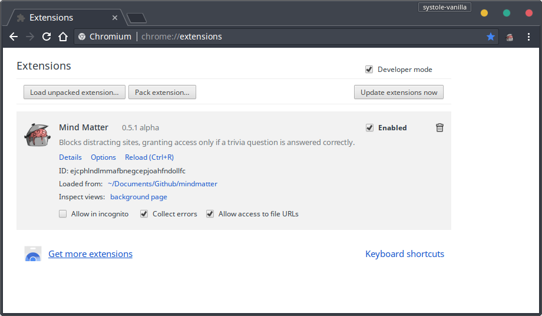
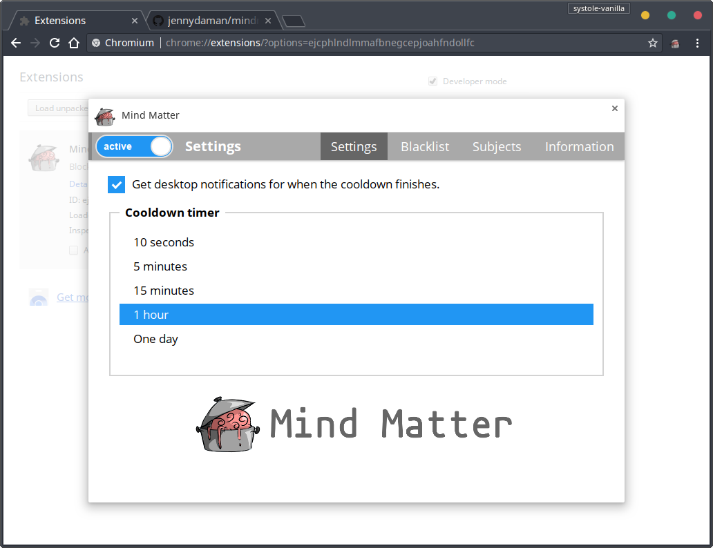
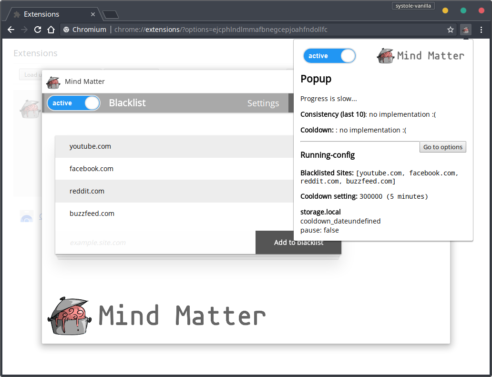

<h1>Mind Matter</h1>

[![Chrome Extension](https://img.shields.io/badge/dynamic/json.svg?logo=data%3Aimage%2Fsvg%2Bxml%3Bbase64%2CPD94bWwgdmVyc2lvbj0iMS4wIiBlbmNvZGluZz0iVVRGLTgiIHN0YW5kYWxvbmU9Im5vIj8%2BPCFET0NUWVBFIHN2ZyBQVUJMSUMgIi0vL1czQy8vRFREIFNWRyAxLjEvL0VOIiAiaHR0cDovL3d3dy53My5vcmcvR3JhcGhpY3MvU1ZHLzEuMS9EVEQvc3ZnMTEuZHRkIj48c3ZnIHZlcnNpb249IjEuMSIgaWQ9IkxheWVyXzEiIHhtbG5zPSJodHRwOi8vd3d3LnczLm9yZy8yMDAwL3N2ZyIgeG1sbnM6eGxpbms9Imh0dHA6Ly93d3cudzMub3JnLzE5OTkveGxpbmsiIHg9IjBweCIgeT0iMHB4IiB3aWR0aD0iMjhweCIgaGVpZ2h0PSIyOHB4IiB2aWV3Qm94PSIwIDAgMjggMjgiIGVuYWJsZS1iYWNrZ3JvdW5kPSJuZXcgMCAwIDI4IDI4IiB4bWw6c3BhY2U9InByZXNlcnZlIj4gIDxpbWFnZSBpZD0iaW1hZ2UwIiB3aWR0aD0iMjgiIGhlaWdodD0iMjgiIHg9IjAiIHk9IjAiICAgIHhsaW5rOmhyZWY9ImRhdGE6aW1hZ2UvcG5nO2Jhc2U2NCxpVkJPUncwS0dnb0FBQUFOU1VoRVVnQUFBQndBQUFBY0NBWUFBQUJ5RGQrVUFBQUFCR2RCVFVFQUFMR1BDL3hoQlFBQUFDQmpTRkpOQUFCNkpnQUFnSVFBQVBvQUFBQ0E2QUFBZFRBQUFPcGdBQUE2bUFBQUYzQ2N1bEU4QUFBQUJtSkxSMFFBQUFBQUFBRDVRN3QvQUFBQUNYQklXWE1BQUE3REFBQU93d0hIYjZoa0FBQUFCM1JKVFVVSDRRd0VDd2tWNnhTb2tnQUFCSmRKUkVGVVNNZWxsbHRzRkZVWWdML3p6OHpPMGdWMnR5MkZoWXBDclhJcHJkUkdCSUpSSkNaaWlBa0pZakhHUkVQaUpRUWZqSWt4UHFqUkYzM1N4QmlpRDZCQTRnT0tDVUlmZkpDQ1FRWFNVS1ZlQ2xKYmJPa1YydEp1eSs0NVBzeE9tVzEzV2d4L01wbGt6cG4vTy8vOUtLYVIxczBid3BZazk5YUZGdS8rcmpGVXA3cEZVREZRRGF3R0tvQWtZSUFCb0JVNEN6UURWMmNDcXhsZ0thQWUyQTZzQkdJaEJ4OEd6Z0VIZ2ErQTdqQm9IakFBVThBVzRDMmdqbHNYQTV3QzNnWWFDa0VuZ0FHWUErekt3UkwvQXhhVXZ0ei9lNEJzRUNvQXl6L2FSbGVSUmNYQXVNckIzcnNOR0VBSjhBR3djN0pCQXRCeVo0emttS2FseFBYZEdMME5tQzh4NEYwTW04UlZGSzJ3UEpjbVBxOUhBUU14Ty9WeTA4QzNyL3c2V09kcVUxaUYxaUNDY2h6QWdCNzMza29JU1hnUUdpV2l0c29zMWJ0b2R4RTIzaS9NSGNuVWY3MWtkdDM5WGFNODBqV0dsb0FDWTFDUkNHNVZEWkhhQjlEelVpalIyT2syZEc4aitsb3pDbzBTUVlrZ3RvWFlEbUxiaUNQcjdiaHN6VncxZXdBUENCU0xZZnV3b3poUU9ZZXFLNk9VYUFGUllBd3lOMDdzcVdmcFhMNlJVNTB4MnJ0QUJDcm1yV0hkZzQ4eGYrUXdwbU0vSWpldzNRaVdHMEZzR3lYaTJXaW90NU1jQklhczZKT3JBTllBcndwRXVtTU84NGJHcWV3ZVFTeEJYSmZaTzU3bnpKSW4rT1M0dytrTGhvNStRM3Vmb2JuZDhGdG5sUExGSzFsWTZoRGxFcmJySW1LaFVKN3J2T2drZ0dQQVpiOUZyYzRGbVJzQ2grNk4wK2JDeU5BSXpvcFZYRjYya1gwbm9XZlFzOHpLUGFMZzd4N0QzaDl0cmtRMlExRWxJZDB1QWRSTVpDbGV1L0ppYk9CaXNjdVJleEtNWmpLWXFscE9YbzU1c0FKNVlZa0hQZDJSUU1kcXBzdmFDaDhvZUwweFR4b3E0MXhZTUFkS1U3VDFxdWtVa2RWd3FWZVJzUmNBVnRpMlpOREN2RHBRQm5wbU94eXVLbUZjUUpSaEpsRUtsREdUVlFYRitFQ04xL1h6RlJnNFVUNkxKdWt6UzB1bWgxa0NTMHMxVnFhRGtCamlNM3dMVzZjQWdXRkg4Y1Z3QzZzV0Q1RktLSFFCWFZrTmxmTVZkZVY5eVBXbTZjN1ZHZ1NleFJzeCtTZFh3c20rQzZweDhBZWVXNStsUEtuUXhvTmt0ZWVqWlNuRmpyWGp1S05IVUdQL0JGUk9zYTRKYmhaK005NDhXemQ1WjhaaytiamxLQzh0MCt6YzlCQVgvNDNUM3E4UUJVdkxOQXRMZS9tait3aExuQVpVeEdBS3Q3Z3p3TzhBZnVHbmdTTGdjU1kxUllWaVhHZjRxZWN2emcvL1NUelJUL244Zm9vU2JaeS9kb0xQemgxaXRmVUxHNG96WWJBczhEN3dNK1NhZDA3S2dHK0F0V0ZCeUJvdmlMWlk2TEVicEFmVFBGcWkrYkphRTdkRDgvTjdZTnRFMGx4OTRhQy8wSTAzcWZ2Q2dKWVNMQ1VZWXpEYVVEekxZdGRka0hSQ1laM0FPejdNcmowNkpjSU5lUFB3T2pPSU5yQ2x6UEJ3VXBNdFRMc0d2QUVjRDM0VWdJQ1Y0RjBMWGdONlEySGFzQ2dLTHk3S0VDMllsSFFDdTRGOS9nZTc5dWhONENSb0Z2Z1U3N2JXU0VnbFAxT1dvVG8yeGJwc0xtWlBBM3ZKZWRxSFFZRXhIVWdpZ0ZKZ2F3NStINURRUUhVMHcvNktFZTZJYVA4MEEzaXBmd0F2OFNZNlZ4QldFRmdBQ29ZNUtKWUROVmxEeGV1cGRQR2JDOU5hbTRtTGNCTmVuZVhGZmpJc0ZKZ0hUbWZCdFNaMmpobkY2TjdGdEgvWVRNb3AzRGNMZ1h6NUQ4WjVrNTlJaGZBQUFBQUFKWFJGV0hSa1lYUmxPbU55WldGMFpRQXlNREUzTFRFeUxUQTBWREUyT2pBNU9qSTBMVEExT2pBd1RGQTFud0FBQUNWMFJWaDBaR0YwWlRwdGIyUnBabmtBTWpBeE55MHhNaTB3TkZReE5qb3dPVG95TVMwd05Ub3dNRzgxb29RQUFBQUFTVVZPUks1Q1lJST0iIC8%2BPC9zdmc%2B&label=chrome&prefix=%E2%89%A5%20v&query=minimum_chrome_version&uri=https%3A%2F%2Fraw.githubusercontent.com%2Fjennydaman%2Fmindmatter%2Fmaster%2Fextension%2Fmanifest.json)](https://developer.chrome.com/extensions)

Mind Matter is an educational Chrome extension that blocks blacklisted sites, granting access only if a trivia question is answered correctly. It deters excessive use of distrating websites while helping users to reinforce their knowledge. This project is open source and ad-free.

## Installation

I hope to publish version 0.5 to the Chrome Web Store. Even though it's not ready yet, you're more than welcome to try it out! The master branch contains the most recent and stable version. It can be installed as an *unpacked extension*.

1. `git clone https://github.com/jennydaman/mindmatter.git` or [Download ZIP](https://github.com/jennydaman/mindmatter/archive/master.zip) and extract it.
2. Go to [chrome://extensions](chrome://extensions).
3. Enable "Developer mode"
4. Click "Load unpacked extension..." and select the mindmatter/extension folder.

## Screenshots

### Rationale

The psychologist Daniel Kahneman describes two systems of thinking. According to [Wikipedia](https://en.wikipedia.org/wiki/Thinking_Fast_and_Slow), "'System 1' is fast, instinctive, and emotional; 'System 2' is slower, more deliberative, and more logical."

Surfing the Internet tends to be unproductive. The objective of *Mind Matter* is to disrupt cognitive ease and force users to perform system 2 thinking.

#### Acknowledgements

Thanks to Sally Zhao (Blair class of 2019) for the "brain in pot" logo.
