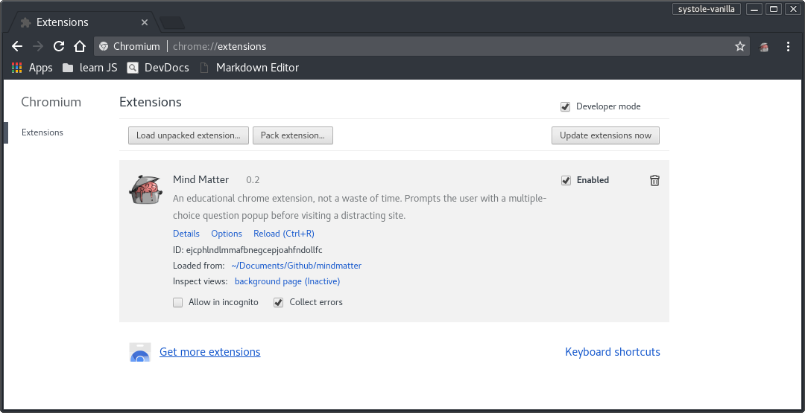

# Mind Matter

### An educational chrome extension, not a waste of time. 

*Previously known as jennydaman/systole.* 
*Just kidding, nobody knew about it...*

What started as a (unsuccessful) [Bitcamp 2017](https://devpost.com/software/systole) project is now a full (and still unsuccessful :persevere:) Chrome extension!

Mind Matter is a Chrome extension that can help you learn new things and stay productive. When attempting to access a "distracting" site, such as Facebook or Reddit, *Mind Matter* will block the site, preventing access until a multiple choice question is answered correctly. 

## Rationale

Psychologist Daniel Kahneman describes two systems of thinking. According to [Wikipedia](https://en.wikipedia.org/wiki/Thinking_Fast_and_Slow), "'System 1' is fast, instinctive, and emotional; 'System 2' is slower, more deliberative, and more logical." It is believed that system 2 thinking is the kind that builds synapses and reinforces learning. Unfortunately, us citizens of the internet do too much mind-numbing System 1 thinking while we pass time consuming memes. The goal of Mind Matter is to deter the user from frequently browsing time-wsting sites, and instead to focus on what matters in life. The questions provided intend to stimulate System 2 thinking. A user should perform a little thinking or research in order to respond to the question.

*But I don't have time for your dumb trivia.*

One objective of this 

*But I need to access this site right now! This is work-related!*

In this case, you may temporarily disable the extension's functionality in the popup or settings. 

## Installation of development version

Although this project is not quite ready for publication, it is installable as an **unpacked extension**.

1. `git clone https://github.com/jennydaman/mindmatter.git` or [Download ZIP](https://github.com/jennydaman/mindmatter/archive/master.zip) and extract it.
2. Go to [chrome://extensions](chrome://extensions).
3. Enable "Developer mode"
4. Click "Load unpacked extension..." and select the mindmatter folder.

5. Brace for dissapointment. 

